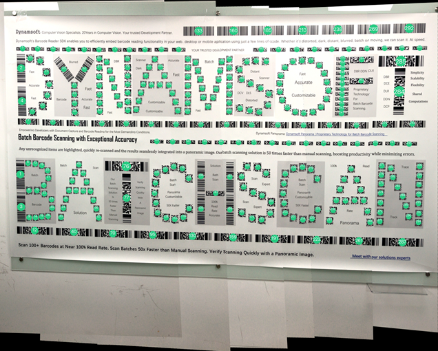
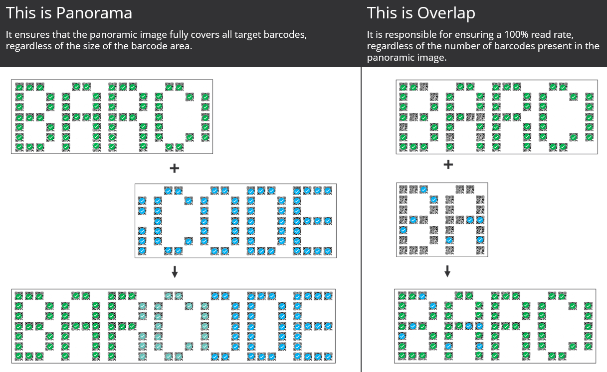
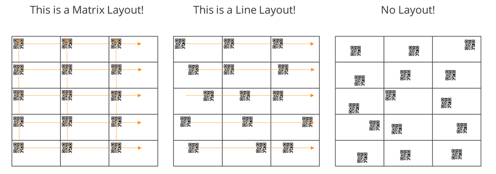
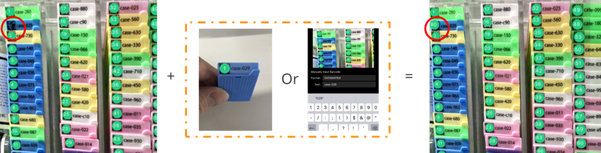
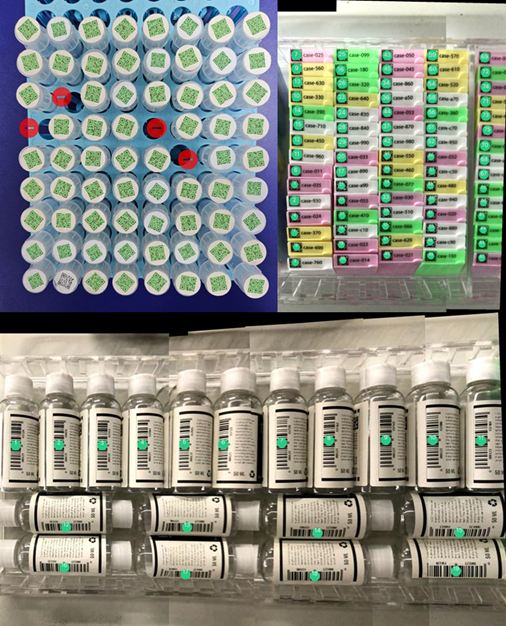
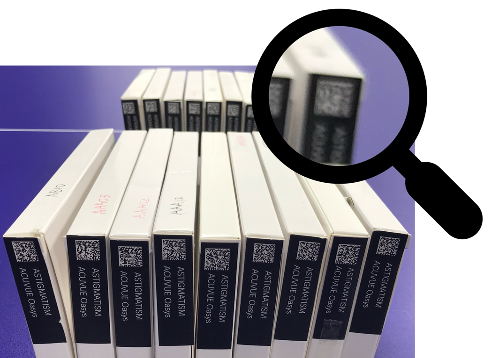
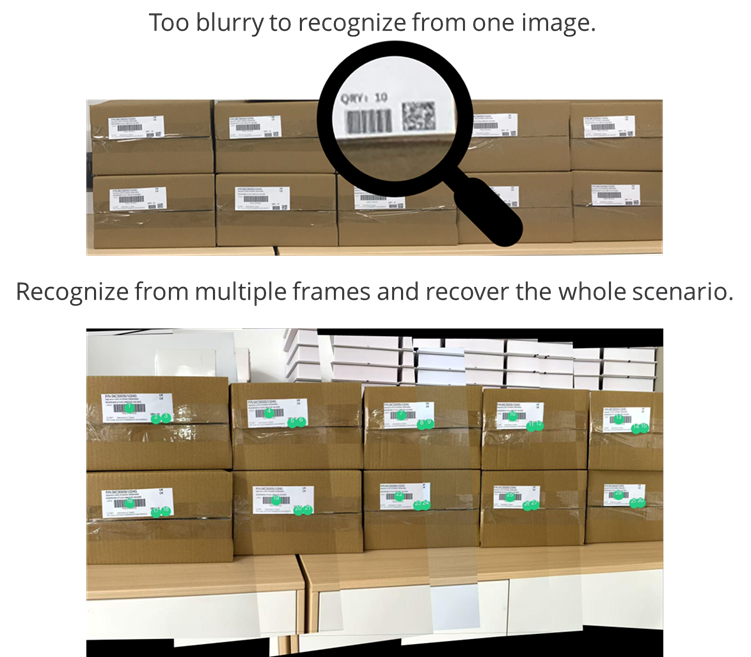

# Dynamsoft Batch Barcode Scanner – Introduction

Dynamsoft Batch Barcode Scanner captures and decodes large groups of barcodes from live video, delivering a read‑rate close to 100 %.

    
    
Batch Barcode Scanner delivers a 100% read‑rate

With Batch Barcode Scanner, you get:

1. **Guaranteed coverage** – Achieve a 100 % read rate, even with numerous barcodes.
2. **Live feedback** – Monitor in real time which barcodes have been read and which remain on a constantly expanding panoramic image.
3. **Panoramic recovery** – Recover missed codes by reviewing the marked barcodes on the consolidated panoramic image.

## 1. Key Features

Batch Barcode Scanner reaches its high accuracy by combining the following capabilities:

### 1.1. Panoramic Technologies

These technologies combine results from multiple frames to handle wide or multi‑plane scenes and plays a critical role in achieving a 100 % read rate.

- Panorama: Stitches the barcodes detected from all captured video frames into a single panoramic image.
- Overlap: Integrates the scan results from the latest frame into the panoramic image.

    
    
Panoramic stitching and result overlapping

### 1.2. Camera‑assisted Enhancement

The camera does more than capture images, it also supplies extra sensor data that guides the panoramic algorithm and sharpens overall accuracy.

- **AR Technology**: Enhances object tracking across large areas and sparsely distributed barcodes.
- **Camera Enhancer**: Provides advanced camera controls for reliable recognition of very small, densely packed codes.

### 1.3. Auto-Stop & Layout Analysis

The scanner accepts flexible auto‑stop conditions, scanning ends automatically once any of them are met.

Layout Analysis is one of the conditions. It examines the spatial arrangement of barcodes to confirm when the task is complete and further boosts recognition accuracy.

    
    
Layout analysis examples

### 1.4. Result-based Features

The scan results also play a big role in the scanning process. The results are:

- **Previewable**: View the real‑time panoramic image with decoded barcodes highlighted.
- **Customizable**: Decide what to scan and define when scanning should stop.
- **Editable**: Correct values, remove non‑target codes, or add new images for further recognition.
- **Reusable**: Save results as historical data for future reference.

    
    
Get 100 % read rate by previewing & editing

## 2. Typical Use Cases

### 2.1. Densely Placed Batch Barcodes

Inventory checks in manufacturing, retail, and healthcare often involve hundreds of tightly packed labels.

    

Challenges

1. Item‑by‑item scanning is slow.
2. A single wide‑area scan may still overlook some codes.
3. Scenes often exceed a single camera frame.
4. Operators need confirmation that every barcode is correctly positioned.

Solution

1. Decodes many barcodes simultaneously.
2. Supports two modes for wide-area processing:
   1. First-pass: Continuously combines and updates results as new frames arrive.
   2. Sectional: Move closer and scan area by area; all views merge into one final panorama.

### 2.2. Scan Different Planes

Sometimes, items are arranged so that their barcodes sit on different planes.

    
    
Barcodes on different planes

Challenges

1. A camera cannot focus on multiple planes simultaneously.
2. Plane‑by‑plane scanning makes the results harder to classify.
3. Determining when to stop scanning one plane and start another can be tricky.

Solution

1. Scan each plane individually, either in a single sweep or section by section.
2. Results from every plane are automatically merged into a single panoramic image for easy review and classification.

### 2.3. Large-scale Item Inventory Check

    
    
Large-scale Item Inventory Check

Challenges

1. Barcodes become too small to decode when the entire scene is captured at once.
2. Duplicate barcodes in the same area can lead to inaccurate or misleading quantity counts.

Solution:

1. Move closer and scan barcodes in smaller segments; the scanner returns a complete set of results when finished.
2. Plane‑projection information records the exact position of each barcode, eliminating duplication issues.

## 3. System Requirements

- Supported Device:
  - iPhone: iPhone 11 or newer
  - iPad: iPad Pro 3rd generation or newer
- Supported OS: iOS 15.0 or later

## 4. Try Our Demo

Request a demo via [request demo form](https://www.dynamsoft.com/use-cases/batch-barcode-scanning/#request-demo-form).