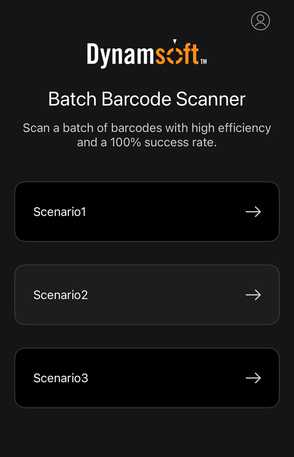

# Start Your First Scan

Follow these steps to perform a basic batch barcode scan.

## 1. Log In

A valid account is required to use the app.  
If your account doesn’t have access to **Dynamsoft Batch Barcode Scanner**, or you don’t yet have an account, you can request one through the [demo request form](https://www.dynamsoft.com/use-cases/batch-barcode-scanning/#request-demo-form).

## 2. (Optional) Select a Scenario

If you have different customized scenarios, they will be displayed on the front page after logging in. After clicking the scenario you want to scan, you will be directed to the working page customized for this scenario.

If customized scanning scenarios are available for your account, they will appear on the home screen after login.  
Tap the desired scenario to open its dedicated scanning workspace.

    

## 3. Start Scanning

    

Tap the **`Start`** button to begin scanning. While scanning, you can:

- Move the device to cover different areas.
- Move closer to any barcode that isn’t recognized.

    

Tap the **`Stop`** button to pause scanning. When paused, you can:

- Add images from the album to enhance the current scan results.
- Tap **`Start`** again to resume.

> [!NOTE]  
> The **Add Image** and **Continue** features are not supported when using the AR camera.

## 4. Finish Scanning

When you’re done, you can:

- **Export** – Save a CSV file of the results and a panoramic image.
- **Save** – Store the current scan results for later viewing in **History**.
- **View History** – Open previously saved results.
- **Reset** – Clear the current session to start a new scan.
