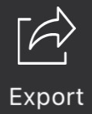

# Operating Manual

This manual explains all features and settings of the app.

## Start / Stop & Reset

    

- **`Start`** – Begin a new scanning task when no result is currently displayed.  
- **`Continue`** – Resume scanning when a panoramic image is being previewed.  
- **`Stop`** – Pause scanning and preview the generated panoramic image.

    

To begin a new task, tap `Reset` first. 
`Reset` clears the currently displayed `BatchBarcodeScanResult`.

---

## Input

### Video Stream

To scan from a live video feed, simply tap `Start` or `Continue`.

### Image

    

You can add images in three ways:

- Capture a new photo.  
- Select an image from your photo album.  
- Choose a `BatchBarcodeScanResult` from history.

### Manual Input

Manually add a barcode by specifying its position, type, and value.

---

## Output

Each scan generates a `BatchBarcodeScanResult`, which includes:

- A collection of decoded barcodes.  
- A panoramic image.

### Save

    

Tap `Save` at any time to store the current `BatchBarcodeScanResult`.  
Saving multiple times creates separate copies.

Saved results can be viewed and edited in **History**.  
Only one `BatchBarcodeScanResult` can be previewed at a time.

### History

    

- **Preview** – Open and edit a saved result in the workspace.  
- **Import** – Merge images and barcodes from a saved result into the current task.
- **Export** – Export data as a .csv or .png file.
- **Manage** – Delete unwanted saved results.

### Export

    

A quick access to the export feature. Export images and barcodes as a `.csv` or `.png` file. 

---

## Settings

### Camera and UI Settings

Settings that define the camera mode and UI behavior.

#### Camera Type

Camera Type

- AR Camera
  - Advantages
    - Ideal for scenarios with sparse barcodes.
    - Provides smooth real-time tracking and visualization of decoded barcodes.
    - Offers higher accuracy in panoramic stitching and barcode counting.
  - Limitations
    - Uses only the wide-angle lens, which cannot focus at close range.
    - Manual focus and zoom controls are unavailable.
- DCE (Dynamsoft Camera Enhancer)
  - Advantages
    - Supports camera selection. You can use the ultra-wide camera for close-up scanning. On Pro Max iPhones, it supports automatic switching between wide and ultra-wide lenses.
    - Provides flexible manual focus and zoom control.
  - Limitations
    - Slightly lower accuracy when duplicate barcodes are present.

#### Resolution

Default: **3840 × 2160**.  
If barcodes are large enough, switch to **1920 × 1080** to improve processing speed.

#### Scan Direction

Specifies the scan direction. It determines how the preview image is displayed.

- Left → Right
- Right → Left
- Top → Bottom
- Bottom → Top

#### Scan Region

Specifies the scan region with a scan region object. It reduces the scan size to improve the speed and the accuracy.

- Left: Distance between the left edge of the frame and the left edge of the scan region.
- Right: Distance between the left edge of the frame and the right edge of the scan region.
- Top: Distance between the top of the frame and the top edge of the scan region.
- Bottom: Distance between the top of the frame and the bottom edge of the scan region.

#### Scan Setting Name

Specify the base `BatchScanSettings` with its name.

### BatchScanSettings

Settings that define how the scanner stitches frames and generates panoramic images.

#### Stitch Level

Determines the stitching effort and affects the final panoramic image quality.

#### Has Duplicate Barcodes

Enables optimization for scenarios where duplicate barcodes appear.

> [!Note]
> If this option is disabled, the scanner will decode only one copy when multiple identical barcodes are detected.

#### Barcode Setting Name

Specify the base `BarcodeSettings` with its name.

#### Barcode Formats

Defines which barcode types exist in the scene and which types to output.

#### Auto Stop

Specifies conditions for automatically stopping the scan. Multiple modes can be enabled simultaneously — scanning stops when any condition is met.

- Stop when layout analysis is approved.
- Stop when the maximum barcode count is reached.
- Stop when no new results are detected.

#### Min Localized Barcode Confidence

Defines the minimum confidence threshold for localized barcodes. A value of 0 disables filtering; 100 filters out all localized results.

#### Layout Settings

Defines layout sections, their analysis modes, and the maximum number of barcodes per section.

Layout Analysis Modes:

- Matrix
- Line
- Skip

### BarcodeSettings

Controls the barcode decoding parameters.

#### Decode Level

Defines the decoding effort level.

#### Barcode Colour Options

Specifies whether to read barcodes in the original color, inverted color, or both.

### Debug Mode Settings

- Display memory Debug info.
- Save original images.
- Save original images with barcode highlights.
- Save intermediate result images.
