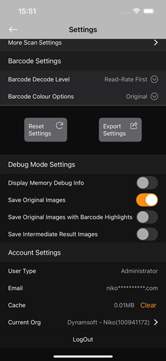

# Troubleshooting

If you run into any issues, feel free to [contact us](https://www.dynamsoft.com/company/customer-service/#contact){:target="_blank"}.

## 1. Initialization Issues

If you see one of the following errors, the app may have failed to initialize.  
Please contact us directly and include the error code.

| Error Code Range | Description |
| ---------------- | ----------- |
| -10002 – -10004  | No valid license for **Barcode Decoding**. |
| -10030 – -10059  | Failed to parse the template file `template_cvr.json`. |
| -70060           | No valid license for **Batch Scanning**. |
| -70063           | Failed to parse the template file `template_panorama.json`. |
| -80001           | Failed to parse the template file `template_ui.json`. |

---

## 2. Performance or Crash Issues

When reporting performance problems or crashes, please provide the following:

- A **screen recording** that reproduces the issue.  
  > Tip: Enable **Settings → More Settings → Debug Mode Settings → Display Memory Debug Info** during recording for more detail.
- Screenshots or a screen recording of the **current settings**.
- **Debug images** captured during scanning.
- **Device information** (model, OS version, available storage, etc.).

### Capturing Original Images

1. Go to **Settings → More Settings → Debug Mode Settings** and enable **`Save Original Images`**.  
2. Return to the scan page and perform a typical scan.  
3. After scanning, the original images are saved to your photo album. Copy them to your desktop.  
4. Compress (ZIP) the images and share the file with Dynamsoft.

    

If requested, you may also need to provide:

- **Original Images with Barcode Highlights**  
- **Intermediate Result Images**  

These additional images are saved to the same folder once their respective options are enabled.
