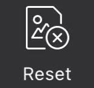
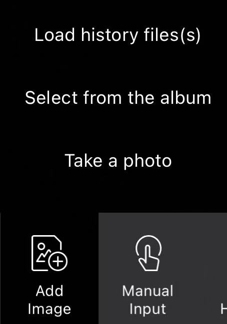
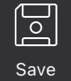
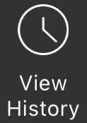
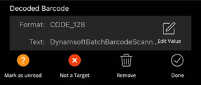
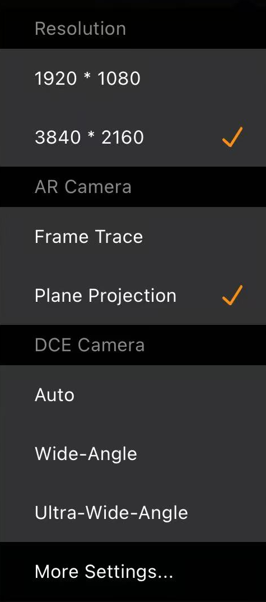

# Operating Manual

This manual explains each features of the APP.

## Mode Selection

Scan modes include:

- `Panorama` (Default)
- `To-the-Start Overlap`
- `To-the-Latest Overlap`

How to select between `Panorama` or `To-the-Start Overlap`:

1. Take a photo for the whole area that you want to scan.
2. Use any barcode reader demo to decode from the photo you took in step 1.

If you the read rate is more than 50%, you can use `To-the-Start Overlap` Mode. Otherwise, you are suggested to use `Panorama` Mode.

When to select `To-the-Latest Overlap`:

If you want to continuously scanning from a fixed area, you might be a user of `To-the-Latest Overlap` mode.

## Start/Stop & Reset

    

- `Start` a new task when there is no result being previewed.
- `Continue` when there is a panoramic image being previewed.
- `Stop` scanning and preview the currently generated panoramic image.

    

To restart a new task, you need to click the `Reset` button first. `Reset` will clean the currently previewing `BatchBarcodeScanResult`.

## Input

### Video Stream

If you want to scan from a live video, you can simply click the `Start/Continue` button.

### Add Image

    

Here are 3 kinds of images you can add:

- Take a new photo
- Select an image from the album.
- Select from a `BatchBarcodeScanResult` from the history.

### Manual Input

Add a new barcode manually. You can specify the location, barcode type, and barcode value for the new barcode.

## Result

Each scanned result is a `BatchBarcodeScanResult` object. It contains:

- A group of `BarcodeResultItem`
- A panoramic image

### Save

    

You can save the currently displayed `BatchBarcodeScanResult` at any time by clicking the save button. If you click the save button for multiple times, the result will be saved as multiple copies.

You can view the history. Every history `BatchBarcodeScanResult` can be previewed in the working interface. While previewing, the `BatchBarcodeScanResult` is editable. You can only preview one `BatchBarcodeScanResult` at once.

### History

    

- Preview: Open the historical result in the working interface. You can preview or edit the historical result.
- Import: Merge the data (image and barcodes) of a historical result to the current batch scan task.
- Export: Export the data (image and barcodes) of a historical result as a file (.csv or .png).
- Manage: Remove unwanted historical results.

### Edit

    

- Remove: Remove the result.
- Mark as unrecognized: Change a `recognized barcode` to a `localized but not recognized barcode`.
- Not a target: Mark a `recognized barcode` or a `localized but not recognized barcode` as a `non-target`.
- Edit value: Edit the format or the text of a `recognized barcode` or a `localized but not recognized barcode`.

## Settings

### Quick Settings

    

#### Resolution

Generally, we use 3840\*2160. If the barcodes is big enough, we can swith to 1920\*1080 to improve the processing speed.

- 3840\*2160
- 1920\*1080

#### Camera Type

- AR Plane Projection: It the first choice if all the target barcodes are on the same plane.
- AR Frame Trace: Trace the previously scanned video frames fluently.
- DCE: Supports macro distance camera. It becomes the best choice when scanning small-scale barcodes.

### Camera and UI Settings

The settings that determines the camera mode and the UI behaviors.

### Camera

#### Scan Region

Specifies the scan region with a scan region object. It reduces the scan size to improve the speed and the accuracy.

- Left: The distance between the left of the video frame and the left edge of the scan region.
- Right: The distance between the left of the video frame and the right edge of the scan region.
- Top: The distance between the top of the video frame and the top edge of the scan region.
- Bottom: The distance between the top of the video frame and the bottom edge of the scan region.

#### Scan Direction

Specifies the scan direction. It determines how the preview image is displayed.

- Scans from left to right
- Scans from right to left
- Scans from top to bottom
- Scans from bottom to top

#### Scan Setting Name

Specify the base `BatchScanSettings` with its name.

### BatchScanSettings

The settings that determines how the scanner stitch the scanned barcodes and generate the panoramic image.

#### Stitch Level

Determines the how much effort to spend on stitching the video frames. It reflects the quality of the panoramic image.

#### Auto Stop

The mode of auto-stop. You can specify multiple modes. If you do so, when one of the modes is met, the scanning will be stopped.

- Stops when layout analysis is approved.
- Stops when the maximum number of barcodes is reached.
- Stops when there is no more result detected.

#### Min Localized Barcode Confidence

The minimum confidence level of the localized barcodes. 0 means do no filter on the localized barcodes. 100 means none of the localized barcodes will be returned.

#### Layout Settings

Defines the layout sections with their layout analysis mode and maximum number of barcodes.

Layout analysis modes include:

- Matrix
- Line
- Skip

You can also define the maximum number of barcodes in each section.

#### Barcode Setting Name

Specify the base `BarcodeSettings` with its name.

### BarcodeSettings

The barcode decoding settings.

#### Barcode Formats

Defines the barcode formats to read.

#### Decode Level

Defines how much effort to spend on decoding the barcodes.

#### Barcode Colour Options

Defines whether to read barcodes with the original color or the inverted color or both.
